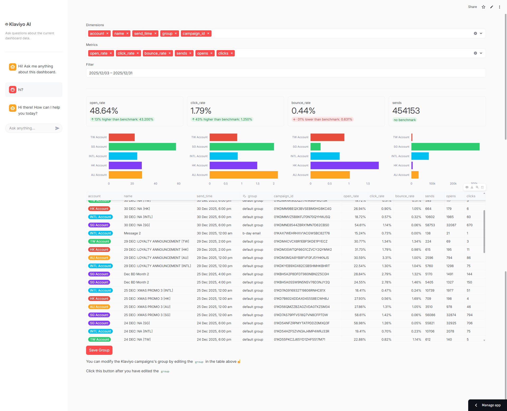

# Demo

You can find the demo here:
👉 [klaviyo-pulse.streamlit.app](https://klaviyo-pulse.streamlit.app)

# WHY KLAVIYO-PULSE

Klaviyo-Pulse is built to solve the limitations of Klaviyo’s native reporting and make performance analysis faster, deeper, and more flexible.

- **Extended Metrics Coverage**  
  Access advanced and derived metrics that are not available in Klaviyo’s default UI.

- **Flexible Aggregation & Grouping**  
  Easily aggregate metrics by account, campaign type, or custom-defined campaign groups, without complex manual setup.

- **Multi-Account Unified View**  
  Fetch and consolidate data from multiple Klaviyo accounts into a single, unified dashboard.

- **AI-Powered Analysis**  
  Built-in AI agent with local dashboard context, allowing you to ask questions and instantly understand your Klaviyo performance with the help of AI (Google Gemini).

# TO DO
- ~~append instead of overwrite the gsheet db~~
- ~~ai agent with local knowledge~~
- ~~save button click twice got bug~~
- match the barchart color with group color
- AI input box sometimes very big
- fillna warnings
